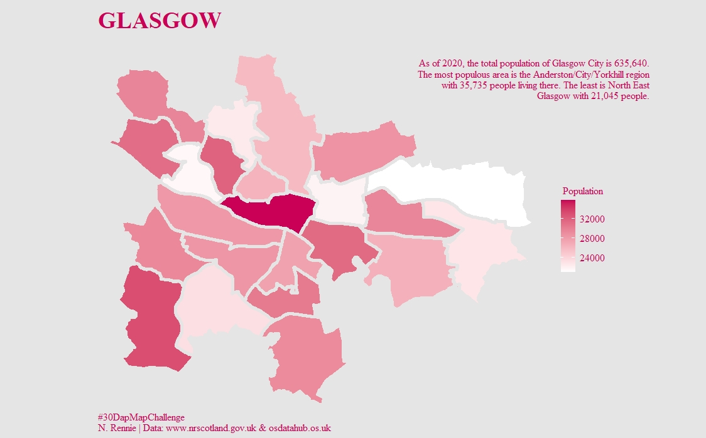
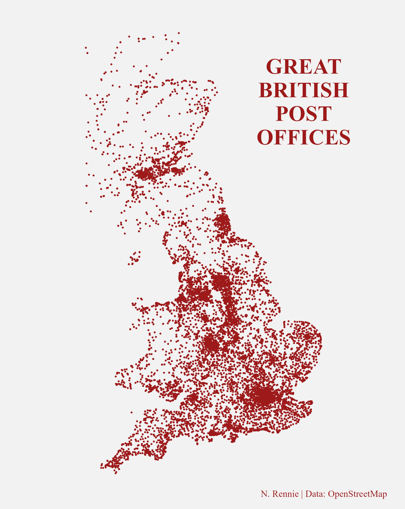
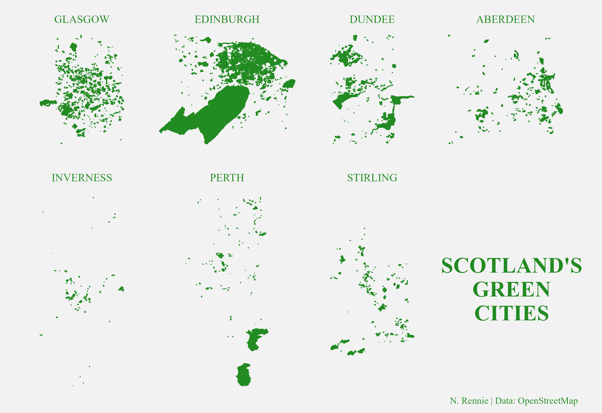
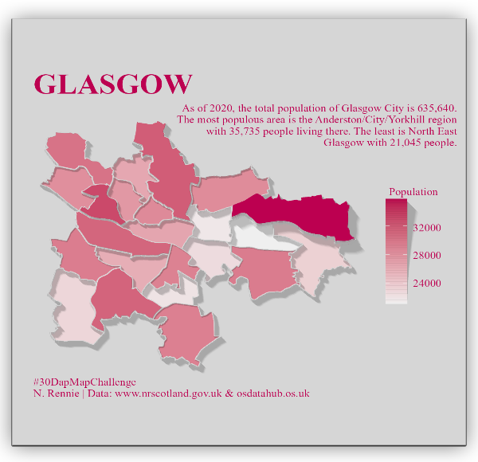
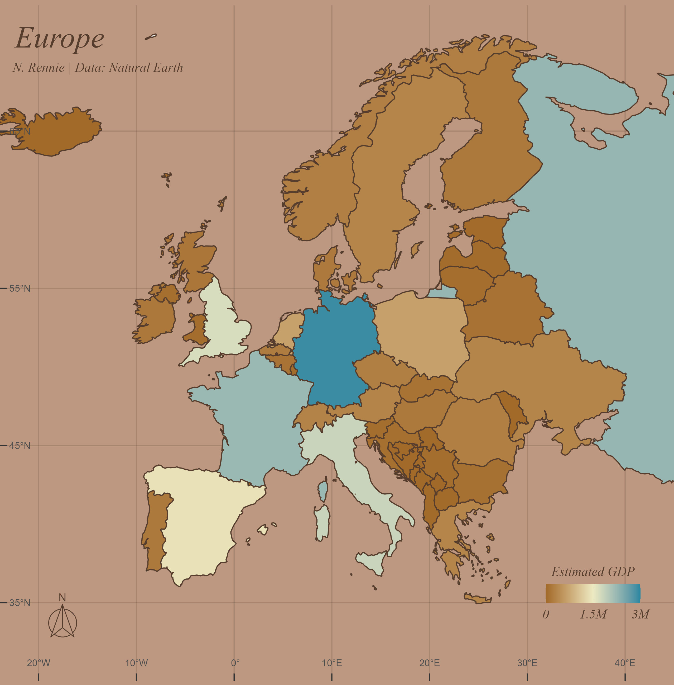
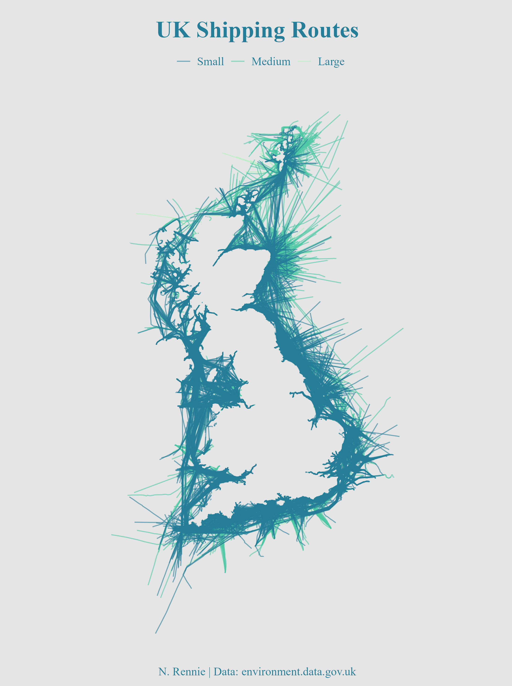
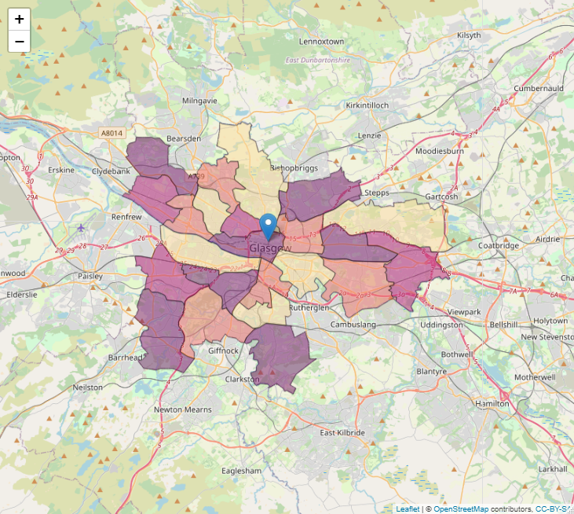
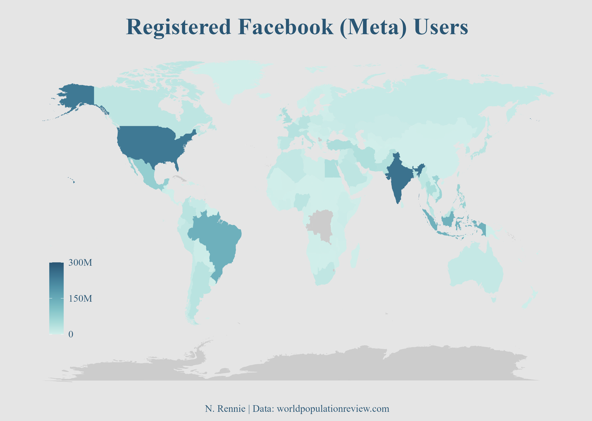

# 2021 30 Day Map Challenge

A repository containing code for the 2021 #30DayMapChallenge. Check out the challenge at [github.com/tjukanovt/30DayMapChallenge](https://github.com/tjukanovt/30DayMapChallenge), or see the prompts below. You can also see my contributions for the challenge on twitter at [@nrennie35](https://twitter.com/nrennie35) from November 1 2021.

My contributions for the #30DayMapChallenge in 2024:

## Day 1 (Points) made with R

## Day 2 (Lines) made with R

## Day 3 (Polygons) made with R

## Day 4 (Hexagons) made with R

## Day 5 (OpenStreetMap) made with R

## Day 6 (Red) made with R

## Day 7 (Green) made with R

## Day 8 (Blue) made with R

## Day 9 (Monochrome) made with R

## Day 10 (Raster) made with R

## Day 11 (3D) made with R

## Day 12 (Population) made with R

## Day 13 (Natural Earth) made with R

## Day 14 (Map with a new tool) made with Tableau

## Day 15 (Map without a computer) made with watercolour

## Day 16 (Urban/rural) made with R

## Day 17 (Land) made with R

## Day 18 (Water) made with R

## Day 19 (Island(s)) made with R

## Day 20 (Movement) made with R

## Day 21 (Elevation) made with R

## Day 22 (Boundaries) made with R

## Day 23 (GHSL) made with R

## Day 24 (Historical map) made with R

## Day 25 (Interactive map) made with R

## Day 26 (Choropleth map) made with R

## Day 27 (Heatmap) made with R

## Day 28 (The Earth is not flat) made with R

## Day 29 (Null) made with R

## Day 30 (Metamapping) made with R

