# 2025 30 Day Map Challenge

A repository containing code for the 2025 #30DayMapChallenge. Check out the challenge at [30daymapchallenge.com](https://30daymapchallenge.com/), or see the prompts below. You can also see my contributions for the challenge on BlueSky at [bsky.app/profile/nrennie.bsky.social](https://bsky.app/profile/nrennie.bsky.social) from November 1, 2025.

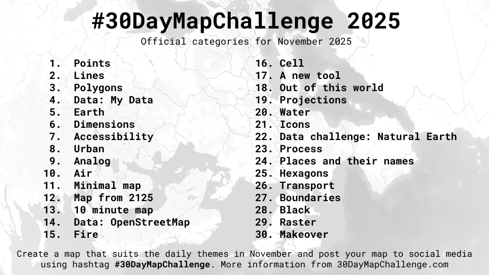

My contributions for the #30DayMapChallenge in 2025:

### Day 1 (Points)

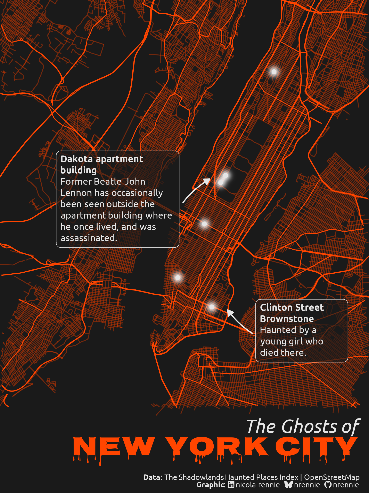

### Day 2 (Lines)

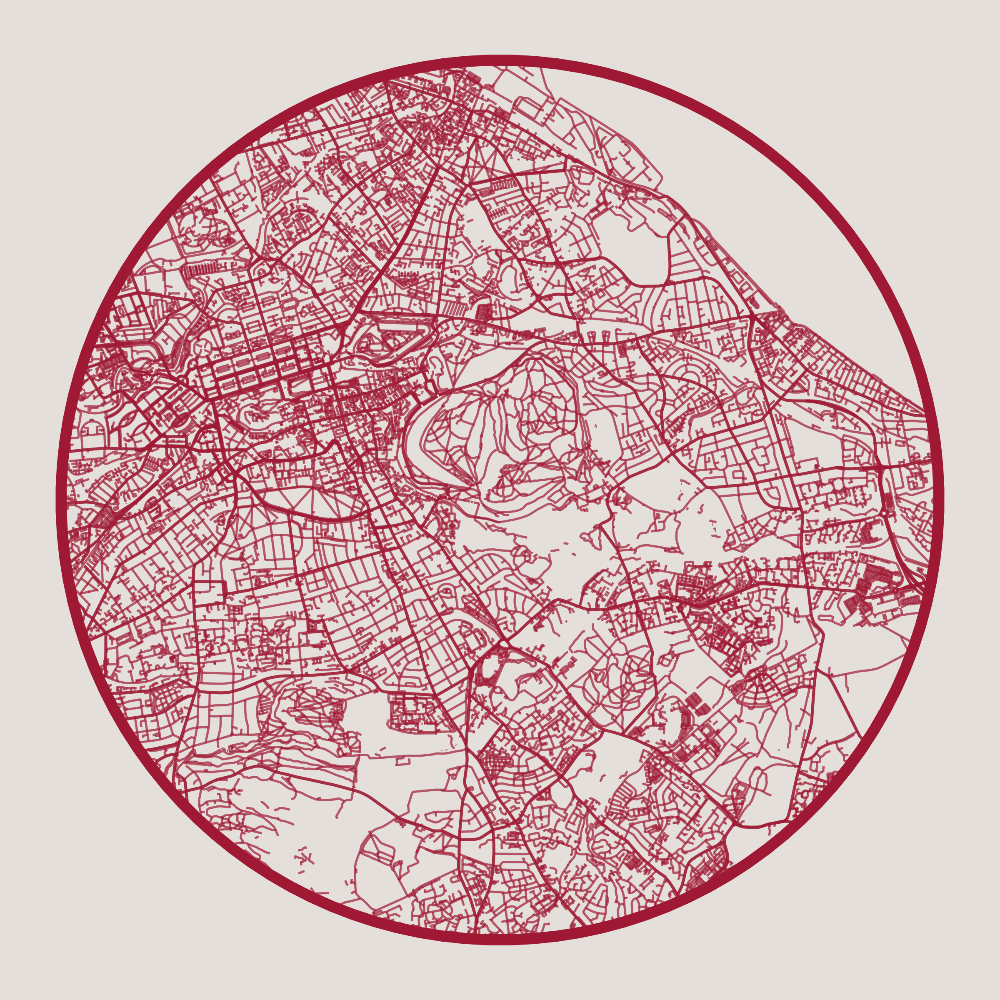

### Day 3 (Polygons)

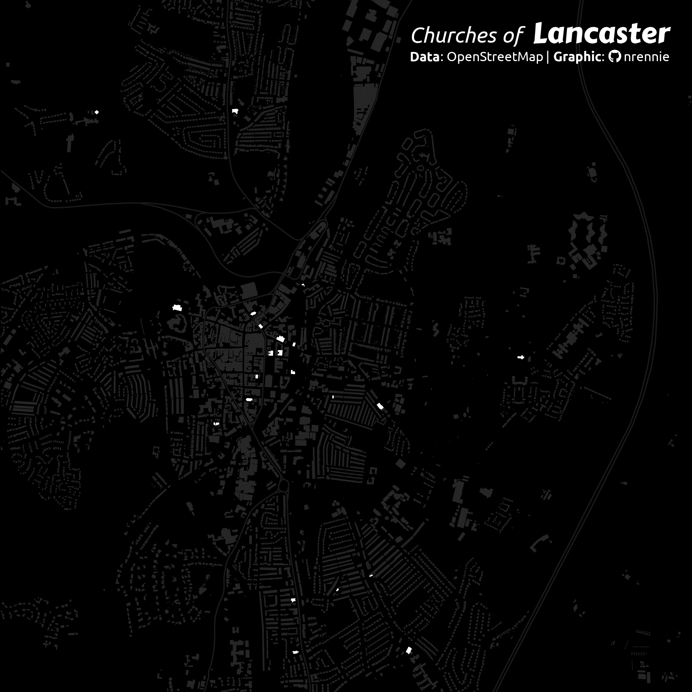

### Day 4 (My Data)

### Day 5 (Earth)

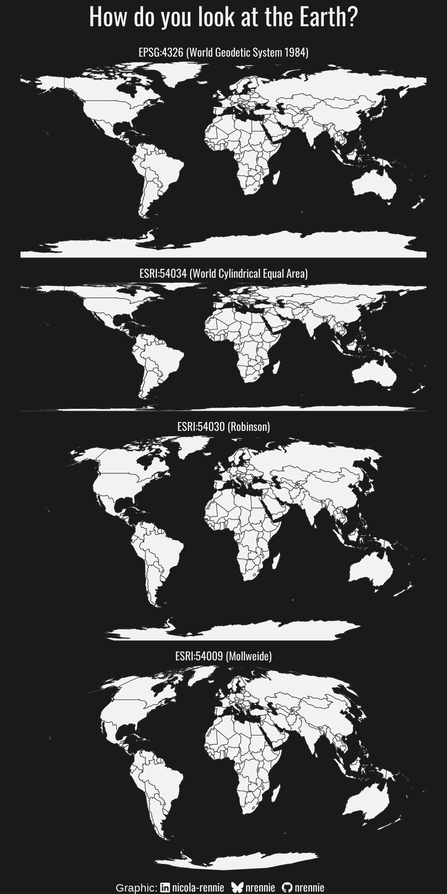

### Day 6 (Dimensions)

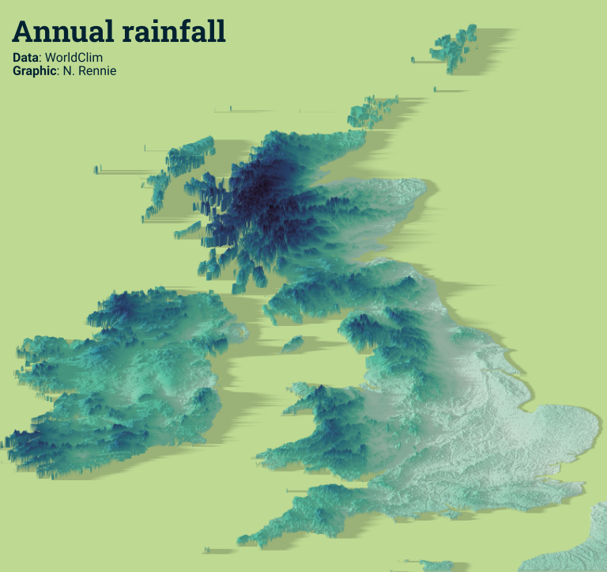

### Day 7 (Accessibility)

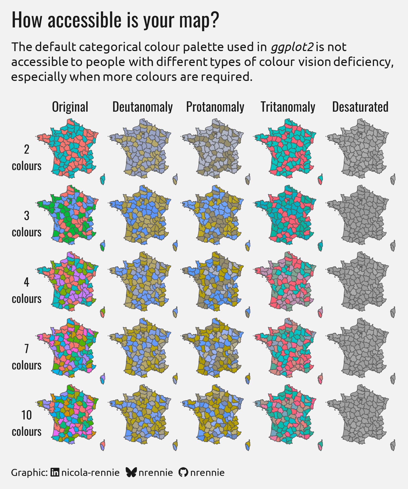

### Day 8 (Urban)

### Day 9 (Analog)

### Day 10 (Air)

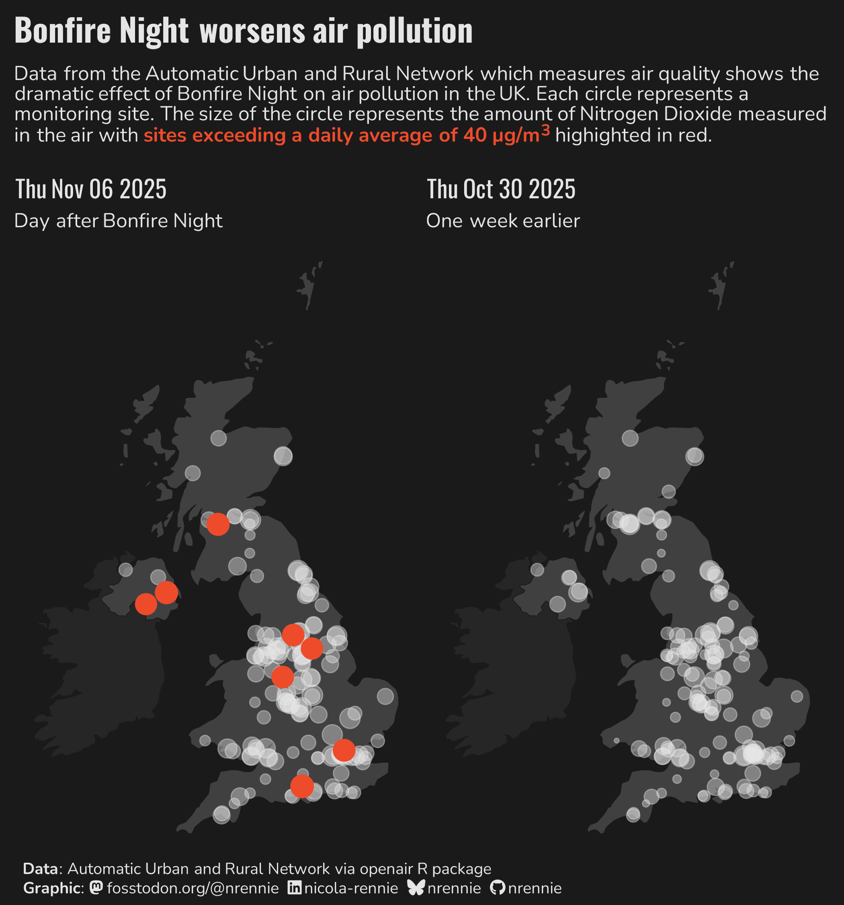

### Day 11 (Minimal)

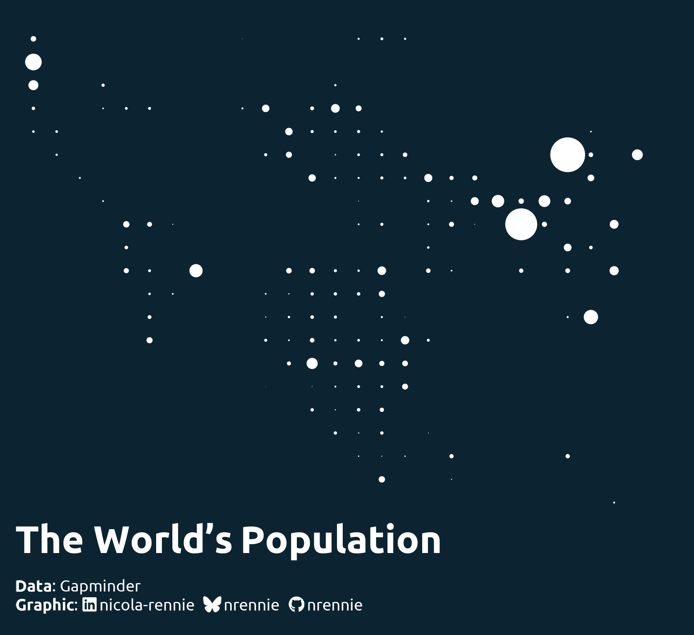

### Day 12 (Map from 2125)

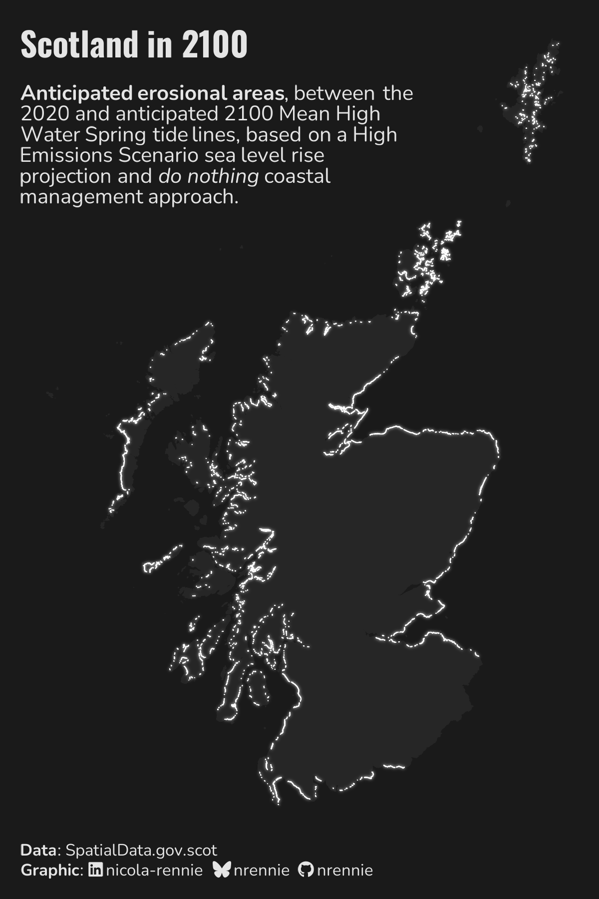

### Day 13 (10 minute map)

### Day 14 (OpenStreetMap)

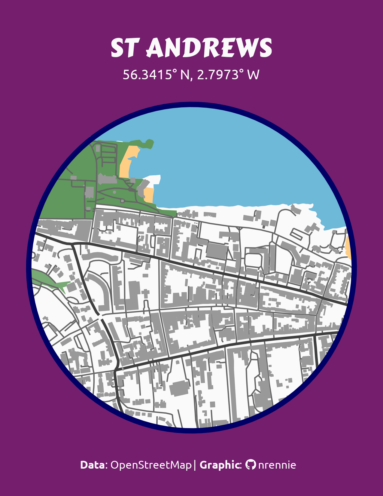

### Day 16 (Cell)

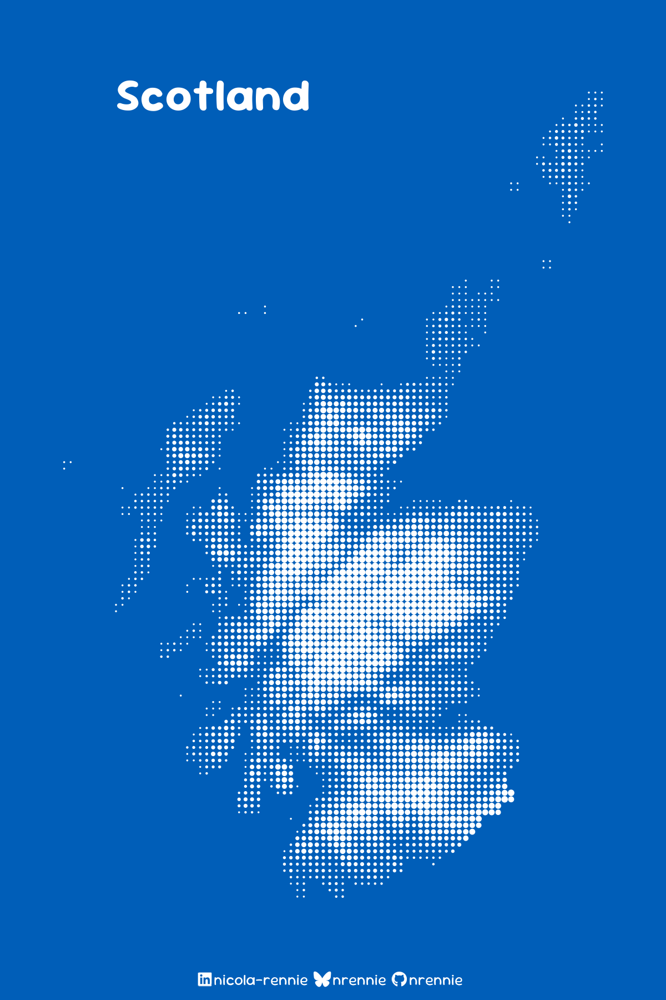

