# 2025 30 Day Map Challenge

A repository containing code for the 2025 #30DayMapChallenge. Check out the challenge at [30daymapchallenge.com](https://30daymapchallenge.com/), or see the prompts below. You can also see my contributions for the challenge on BlueSky at [bsky.app/profile/nrennie.bsky.social](https://bsky.app/profile/nrennie.bsky.social) from November 1, 2025.

My contributions for the #30DayMapChallenge in 2025:

## Day 1 (Points) made with R

## Day 2 (Lines) made with R

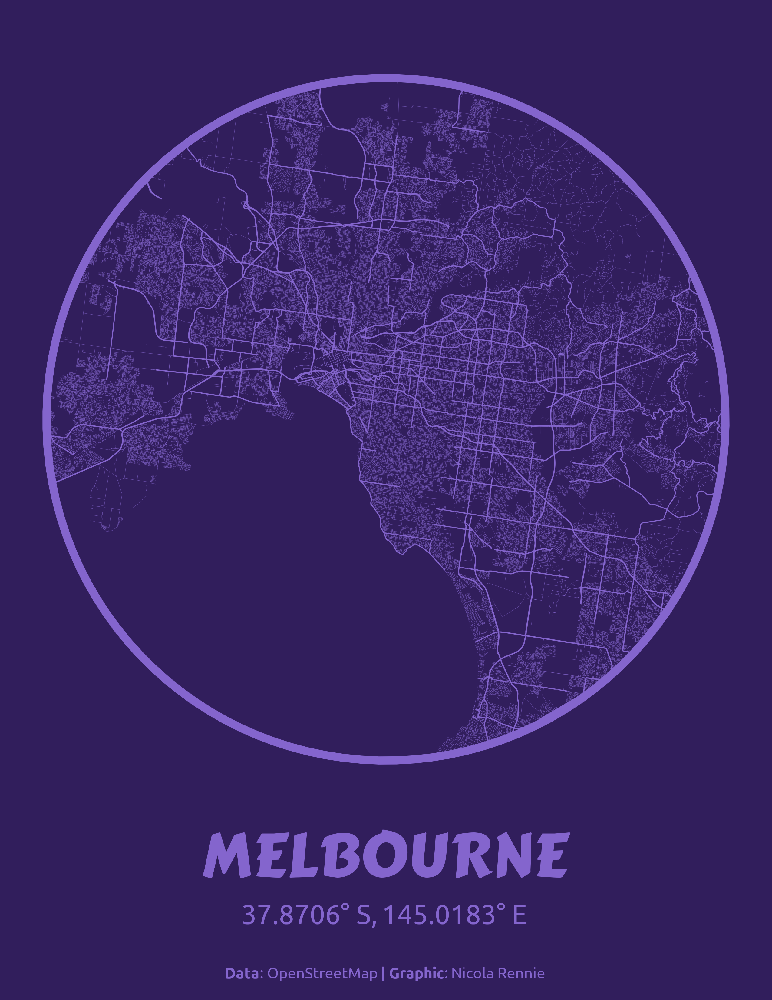

## Day 3 (Polygons) made with R

## Day 4 (My Data) made with R

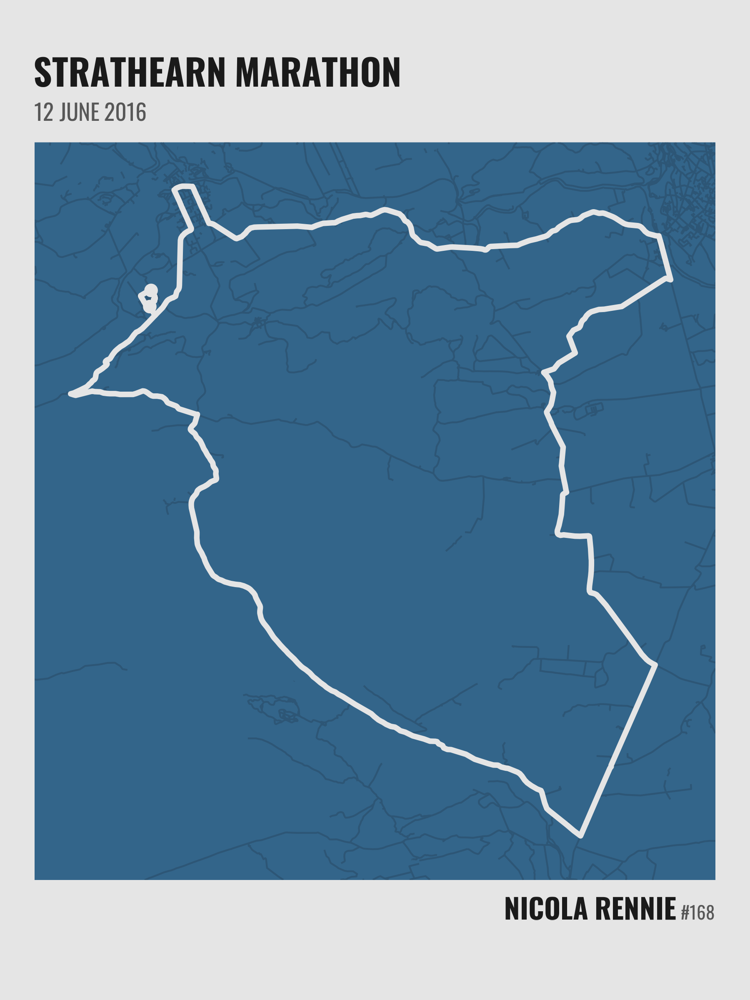

## Day 5 (Earth) made with R

## Day 6 (Dimensions) made with R

## Day 7 (Accessibility) made with R

## Day 8 (Urban) made with R

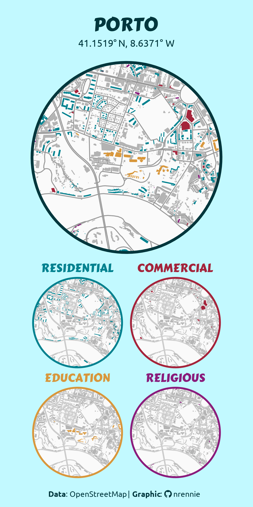

## Day 9 (Analog) made with pencil

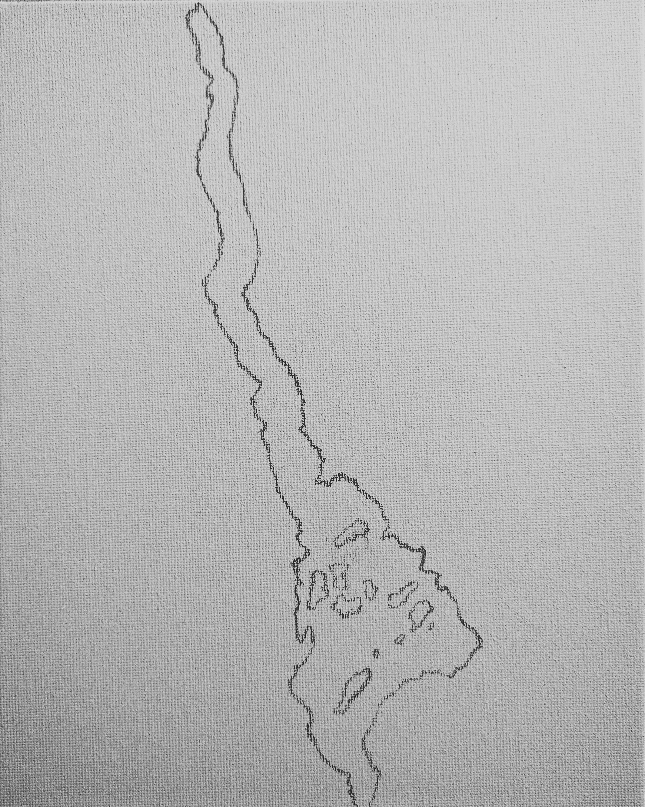

## Day 10 (Air) made with R

## Day 11 (Minimal) made with R

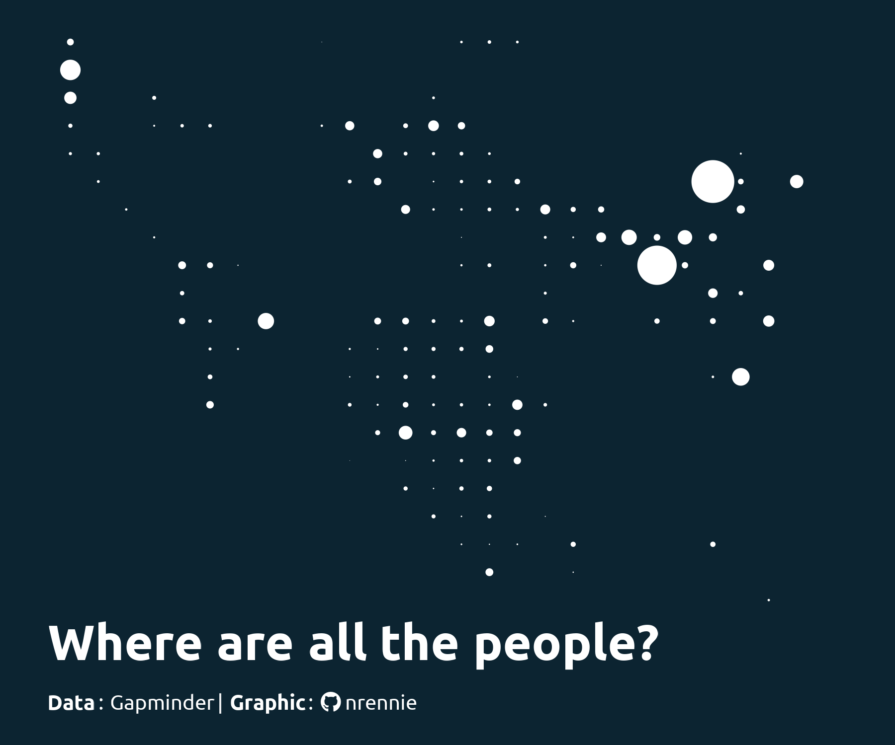

## Day 12 (Map from 2125) made with R

## Day 13 (10 minute map) made with R

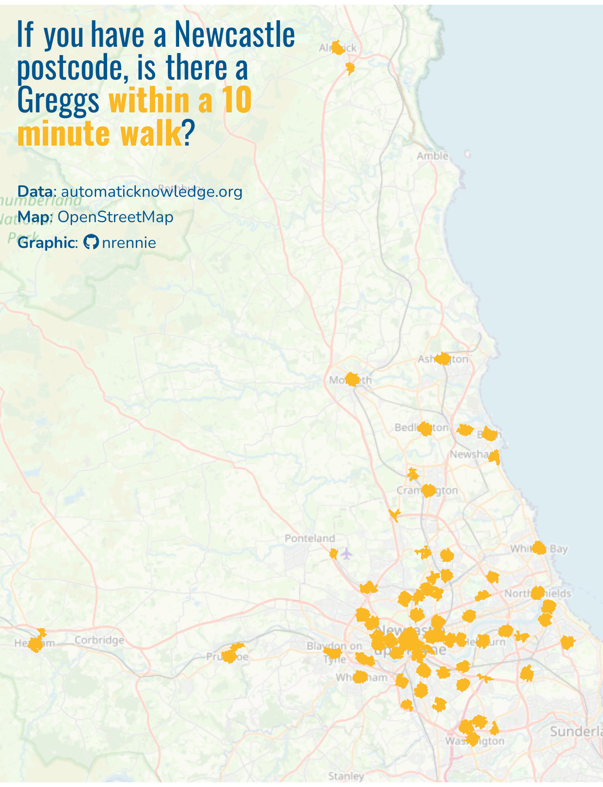

## Day 14 (OpenStreetMap) made with R

## Day 15 (Fire) made with R

## Day 16 (Cell) made with R

## Day 17 (New tool) made with R

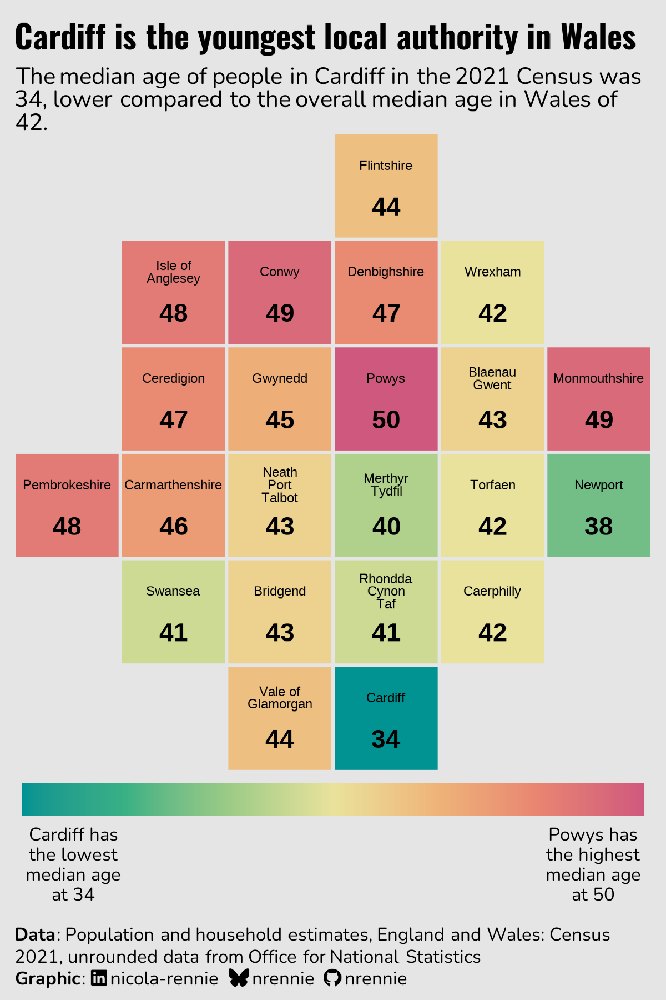

## Day 18 (Out of this World) made with R

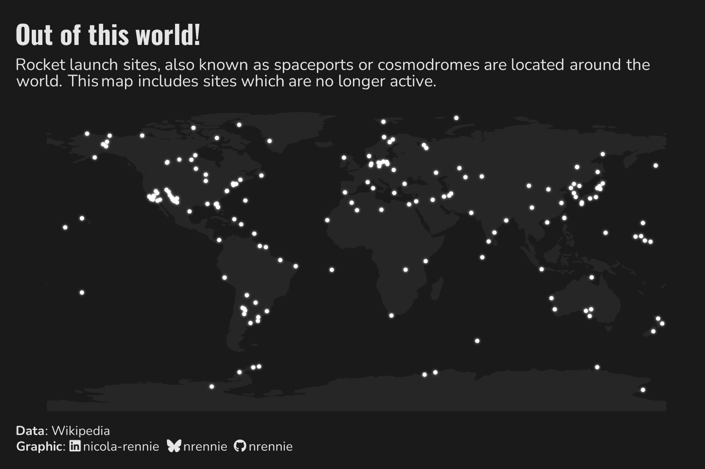

## Day 19 (Projections) made with R

## Day 20 (Water) made with R

## Day 21 (Icons) made with R

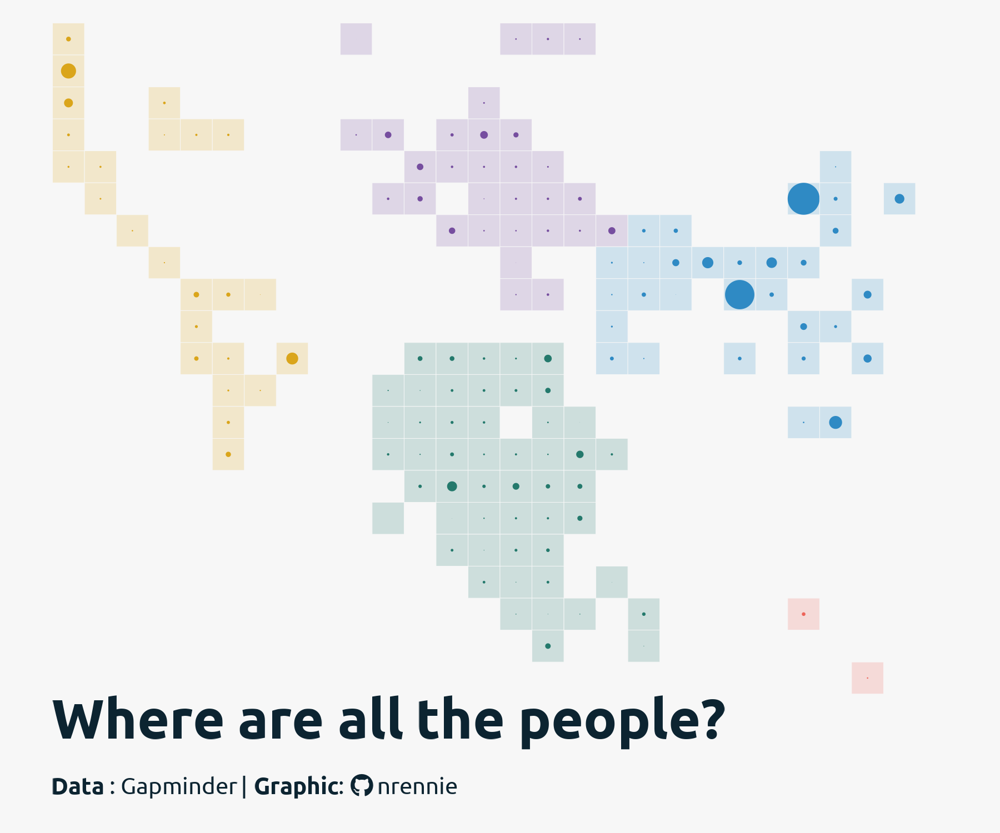

## Day 22 (Natural Earth) made with R

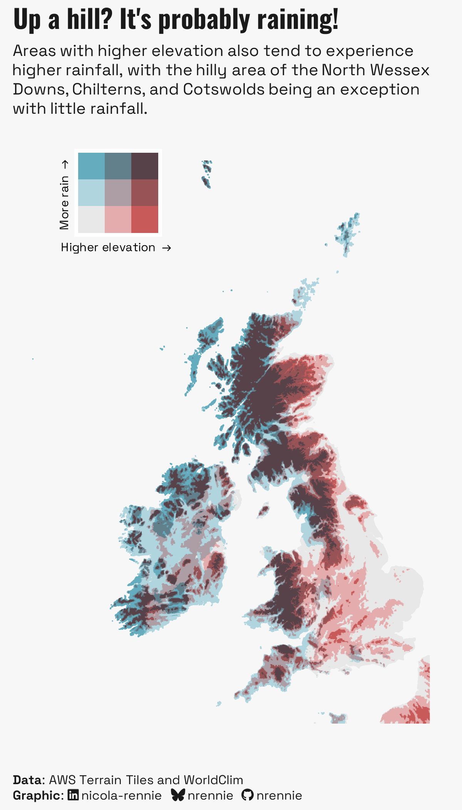

## Day 30 (Makeover) made with R

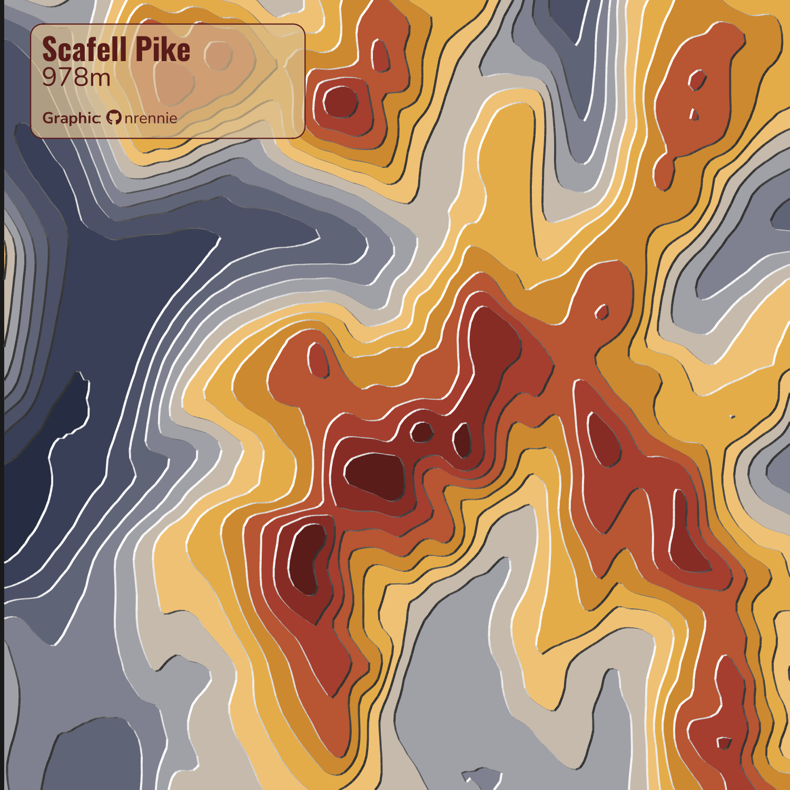

Original chart: [2022 (Day 18)](https://github.com/nrennie/30DayMapChallenge/blob/main/2022/maps/day_day_18.png)

